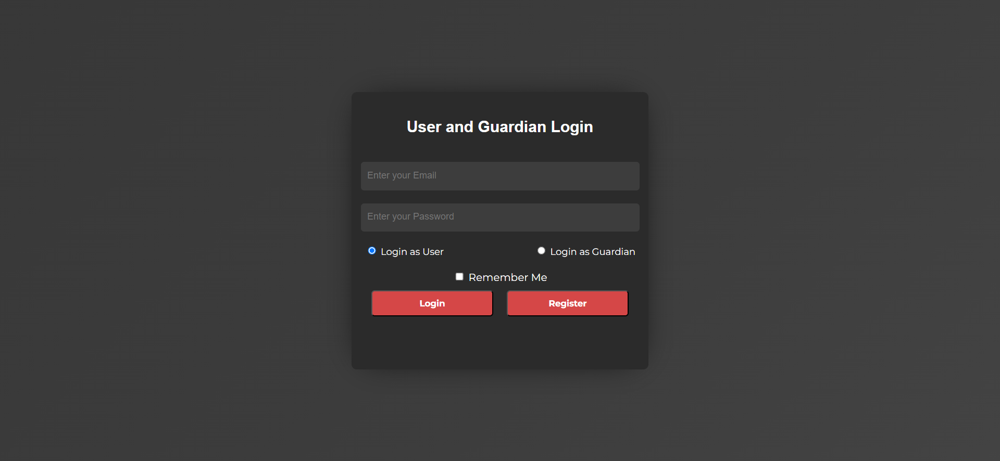
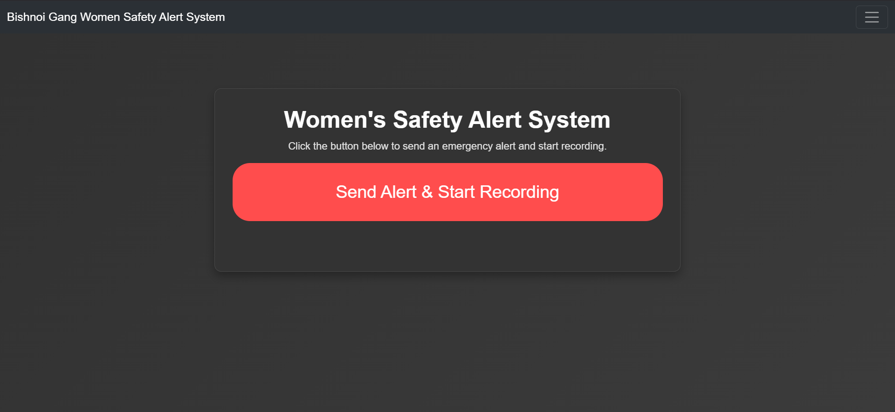
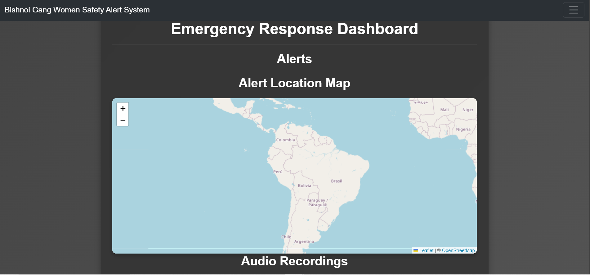

  
# 🚨 Women's Safety Alert System
  

*A modern web application designed to enhance women's safety through real-time alerts and emergency response features* 

## ✨ Features

### 1. Login and Registration System
- The app includes a secure login and registration system that allows both **Users** and **Guardians** to sign up and log in.
- **Users** are those who can send alerts, while **Guardians** are trusted contacts who receive alerts and monitor the user’s location.
- Email-based authentication ensures that each account is uniquely identified and provides a straightforward login process.

### 2. Role-Based Dashboard Navigation
- After logging in, users and guardians are routed to different dashboards:
  - **Users** are directed to `index.html`, where they can initiate emergency alerts.
  - **Guardians** are directed to `dashboard.html`, where they can view alerts and track their assigned user’s location.

### 3. Real-Time Emergency Alerts with Socket.io
- Users can trigger an alert during emergencies, notifying their assigned guardians in real-time.
- Alerts are powered by **Socket.io** to ensure instant updates between users and guardians.

### 4. Location Tracking
- The app shares the user’s current location with their assigned guardian as soon as an alert is triggered.
- Location updates are displayed on the guardian’s dashboard, allowing them to track the user’s movements in real-time.

### 5. Nearest Police Station and Hospital Locator
- When the user triggers an alert, the app shows the locations of nearby police stations and hospitals on both the user and guardian dashboards.
- This feature aids both users and guardians in identifying nearby help points during emergencies.

### 6. Audio Recording Upload for Evidence
- Users can upload audio recordings as evidence of the emergency situation.
- The recordings are securely stored in **Firebase Storage**, allowing guardians to access them through the dashboard.

### 7. Controlled Access for Guardians
- Only the assigned guardian(s) of a user can access that user's alerts, recordings, and location data.
- This access control ensures privacy and security for the user’s sensitive information.

### 8. Modern UI Design
- The app has a user-friendly interface with animated elements and a gradient background in shades of yellow, orange, pink, purple, and blue.
- Fonts like **Montserrat** and **Bowlby One SC** are used for a modern, clean look.

### 9. Responsive Design for Mobile Compatibility
- The UI has been optimized for mobile devices, especially focusing on features like a shorter login container for smaller screens to enhance the app’s usability.

---
## 🛠️ Tech Stack

- **Frontend**: CSS and Bootstraps
- **Backend**: Node.js & Express
- **Database**: Firebase
- **Authentication**: Firebase
- **Maps Integration**: leaflet API

## 📱 App Screenshots

  
  
  

## 🤝 Contributing

We welcome contributions! Please follow these steps:

1. Fork the repository
2. Create your feature branch (`git checkout -b feature/AmazingFeature`)
3. Commit your changes (`git commit -m 'Add some AmazingFeature'`)
4. Push to the branch (`git push origin feature/AmazingFeature`)
5. Open a Pull Request

## 🙏 Acknowledgments

- Emergency response API providers
- Open-source community
- All contributors who help make women's safety a priority

---

  
### Made with ❤️ for a safer world

